# Vortex

Backend del proyecto **OpenLifting**: una API REST que recibe datos de activación muscular (EMG) capturados por sensores + ESP32 durante series de sentadillas, los persiste, y los expone a la app Android para visualización, seguimiento histórico y entrega de recomendaciones técnicas.

El backend actúa como **destino de sincronización**, no como motor de cálculo: las métricas (BSA, ratios H:Q y ES:GMax, fatiga intra-set) se computan en el dispositivo móvil y se envían ya resueltas en un único POST por serie.

## Stack

- Laravel 12 / PHP 8.2+
- PostgreSQL
- Laravel Sanctum (auth por bearer token)

## Diagrama Entidad-Relación
### Mermaid

```mermaid
erDiagram
    users }o--|| roles : role
    athlete_profiles }o--|| users : user
    guest_profiles }o--|| users : created_by
    guest_profiles }o--|| users : claimed_by
    mvc_calibrations }o--|| athlete_profiles : athlete
    mvc_calibrations }o--|| guest_profiles : guest
    instructor_athlete }o--|| users : instructor
    instructor_athlete }o--|| users : athlete
    training_sessions }o--|| users : athlete
    training_sessions }o--|| guest_profiles : guest
    training_sessions }o--|| users : instructor
    training_sets }o--|| training_sessions : session
    reps }o--|| training_sets : set
    set_metrics }o--|| training_sets : set
    recommendations }o--|| training_sets : set
    claim_codes }o--|| training_sessions : session
    claim_codes }o--|| users : user

    roles {
        INT id
        STRING name
        TIMESTAMP created_at
        TIMESTAMP updated_at
        TIMESTAMP deleted_at
    }

    users {
        BIGINT id
        STRING email
        STRING name
        STRING password
        INT role_id
        TIMESTAMP created_at
        TIMESTAMP updated_at
        TIMESTAMP deleted_at
    }

    athlete_profiles {
        BIGINT id
        BIGINT user_id
        STRING first_name
        STRING last_name
        FLOAT bodyweight_kg
        INT age_years
        STRING sex
        TIMESTAMP calibrated_at
        TIMESTAMP created_at
        TIMESTAMP updated_at
        TIMESTAMP deleted_at
    }

    guest_profiles {
        BIGINT id
        BIGINT created_by_user_id
        BIGINT claimed_by_user_id
        STRING first_name
        STRING last_name
        FLOAT bodyweight_kg
        INT age_years
        STRING sex
        TIMESTAMP calibrated_at
        TIMESTAMP claimed_at
        TIMESTAMP created_at
        TIMESTAMP updated_at
        TIMESTAMP deleted_at
    }

    mvc_calibrations {
        BIGINT id
        BIGINT athlete_profile_id
        BIGINT guest_profile_id
        FLOAT vastus_lateralis_left
        FLOAT vastus_lateralis_right
        FLOAT vastus_medialis_left
        FLOAT vastus_medialis_right
        FLOAT gluteus_maximus_left
        FLOAT gluteus_maximus_right
        FLOAT erector_spinae_left
        FLOAT erector_spinae_right
        FLOAT biceps_femoris_left
        FLOAT biceps_femoris_right
        TIMESTAMP recorded_at
        TIMESTAMP deleted_at
    }

    instructor_athlete {
        BIGINT instructor_id
        BIGINT athlete_id
        TIMESTAMP linked_at
        TIMESTAMP deleted_at
    }

    training_sessions {
        BIGINT id
        BIGINT athlete_user_id
        BIGINT guest_profile_id
        BIGINT instructor_user_id
        STRING exercise
        TIMESTAMP started_at
        TIMESTAMP ended_at
        STRING device_source
        TIMESTAMP created_at
        TIMESTAMP updated_at
        TIMESTAMP deleted_at
    }

    training_sets {
        BIGINT id
        BIGINT session_id
        INT set_number
        FLOAT load_kg
        INT target_reps
        STRING variant
        STRING depth
        FLOAT rpe
        TIMESTAMP created_at
        TIMESTAMP deleted_at
    }

    reps {
        BIGINT id
        BIGINT set_id
        INT rep_number
        INT duration_ms
        FLOAT vastus_lateralis_left_pct
        FLOAT vastus_lateralis_left_peak_pct
        FLOAT vastus_lateralis_right_pct
        FLOAT vastus_lateralis_right_peak_pct
        FLOAT vastus_medialis_left_pct
        FLOAT vastus_medialis_left_peak_pct
        FLOAT vastus_medialis_right_pct
        FLOAT vastus_medialis_right_peak_pct
        FLOAT gluteus_maximus_left_pct
        FLOAT gluteus_maximus_left_peak_pct
        FLOAT gluteus_maximus_right_pct
        FLOAT gluteus_maximus_right_peak_pct
        FLOAT erector_spinae_left_pct
        FLOAT erector_spinae_left_peak_pct
        FLOAT erector_spinae_right_pct
        FLOAT erector_spinae_right_peak_pct
        FLOAT biceps_femoris_left_pct
        FLOAT biceps_femoris_left_peak_pct
        FLOAT biceps_femoris_right_pct
        FLOAT biceps_femoris_right_peak_pct
        TIMESTAMP deleted_at
    }

    set_metrics {
        BIGINT id
        BIGINT set_id
        FLOAT bsa_vl_pct
        FLOAT bsa_vm_pct
        FLOAT bsa_gmax_pct
        FLOAT bsa_es_pct
        FLOAT hq_ratio
        FLOAT es_gmax_ratio
        FLOAT intra_set_fatigue_ratio
        INT thresholds_version
        TIMESTAMP deleted_at
    }

    recommendations {
        BIGINT id
        BIGINT set_id
        STRING text
        STRING severity
        STRING evidence
        TIMESTAMP deleted_at
    }

    claim_codes {
        BIGINT id
        BIGINT session_id
        STRING code
        TIMESTAMP expires_at
        TIMESTAMP used_at
        BIGINT used_by_user_id
        TIMESTAMP created_at
        TIMESTAMP deleted_at
    }
```


### Diagrama

>! Screenshot tomada en https://github.com/EmilioGiordano/DBiewer

## Instalación

```bash
git clone <repo-url> vortex
cd vortex
composer install
cp .env.example .env
php artisan key:generate
```

Configurar credenciales de PostgreSQL en `.env` (`DB_DATABASE=backend_openlifting`, usuario y contraseña según tu entorno).

```bash
php artisan migrate --seed
```

## Correr la app

```bash
php artisan serve
```

API disponible en `http://127.0.0.1:8000`.

## Tests

```bash
composer test
```
